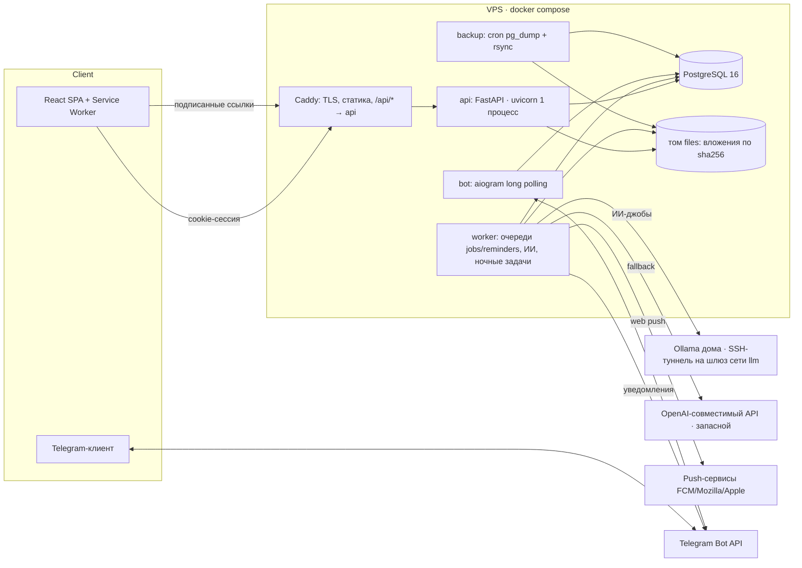

# AUDIT_CONTEXT — Veillou

Фаза 0 аудита (разведка, код не менялся). Дата: 2026-10-08, ветка `m13-projects-v2` @ `31943fa`.

## Что это

**Veillou** — личный планировщик учёбы и жизни для одного пользователя (регистрации нет,
пользователь создаётся через CLI). Расписание пар → календарь, задания с шагами,
«долгий ящик», проекты, конспекты/литература с полнотекстовым поиском, экзамены с планом
подготовки, автопланировщик (CP-SAT) с превью/применением/откатом, напоминания (Web Push +
Telegram), Telegram-бот для быстрого ввода, ИИ (Ollama / OpenAI-совместимый API) для разбивки
заданий, разбора текста и фото.

## Стек

| Слой | Технологии |
|---|---|
| Backend | Python 3.12, FastAPI 0.142, Pydantic v2, SQLAlchemy 2 (async, asyncpg), Alembic, pwdlib/argon2, OR-Tools CP-SAT, httpx, pywebpush, aiogram 3 |
| БД | PostgreSQL 16 (FTS `russian`, JSONB, частичные уникальные индексы) |
| Frontend | React 19, TypeScript 5.9 (strict), Vite 8, TanStack Query (персист в IndexedDB), FullCalendar, shadcn/Radix, react-markdown + KaTeX, PWA (свой service worker, Web Share Target) |
| Инфраструктура | Docker Compose (prod), Caddy 2 (TLS + статика + reverse proxy), cron-контейнер бэкапов, обратный SSH-туннель к домашней Ollama |
| Инструменты | uv (`uv.lock`), npm (`package-lock.json`), ruff, oxlint, tsc, pytest (+hypothesis), GitHub Actions |

Объём: backend `app/` ≈ 23 тыс. строк (17 тыс. LOC), тесты ≈ 10 тыс. строк (720 тестов),
frontend `src/` ≈ 34 тыс. строк, тестов фронта нет.

## Архитектура

Слои бэкенда (`backend/app/`):

- `api/` — роутеры FastAPI (тонкие, зависимость `CurrentUser` + сервис);
- `services/` — бизнес-логика и работа с БД; `services/base.py:UserScopedRepository` ограничивает
  каждый запрос `user_id = :me AND deleted_at IS NULL`;
- `domain/` — чистые функции без БД (планировщик CP-SAT + жадный fallback, quickparse, RRULE,
  SRS, бэклог, экзамены);
- `models/` — SQLAlchemy (UUID PK, мягкое удаление, `UTCDateTime` запрещает naive datetime);
- `schemas/` — Pydantic (входные модели `extra="forbid"`);
- `notify/` — builder напоминаний, формат сообщений, отправители (push, Telegram),
  SQLAlchemy `after_flush`-триггеры, ставящие джобы пересборки;
- `ai/` — провайдеры LLM, промпты, схемы ответов, eval-набор;
- `bot/` — Telegram-бот; `worker/` — фоновый процесс; `cli.py` — админ-команды.

Потоки данных:

1. Браузер → Caddy → `/api/v1/*` (cookie `veillou_session`, HttpOnly, SameSite=Lax, Secure в проде).
2. Любая правка → `after_flush` → INSERT в `jobs` (`reminders.sync`, `plan.preview`, с dedupe) →
   worker забирает `FOR UPDATE SKIP LOCKED` → пересобирает `reminders` / превью плана.
3. Worker: `reminders` (due) → рендер → push/Telegram; кнопки пуша → `POST /notifications/action`
   по одноразовому токену без сессии.
4. ИИ: API ставит джобу → worker (отдельный FIFO-цикл) → LLM → ответ валидируется Pydantic →
   черновик в `jobs.result` → фронт поллит `GET /jobs/{id}` / бот получает карточку.
5. Файлы: `POST /attachments` (multipart) → диск по sha256 → `GET /files/{id}?exp&sig` (HMAC, без cookie).

## Граница доверия

| Источник | Что приходит | Где проверяется |
|---|---|---|
| Браузер (аноним) | `/health`, `/auth/login`, `/auth/logout`, `/notifications/action` (токен), `/files/{id}` (подпись) | Pydantic, argon2, HMAC, sha256 токена |
| Браузер (сессия) | 135 остальных операций API | `get_current_user` (`api/deps.py:42`), user-scoping в сервисах |
| Telegram | апдейты бота | `bot/middleware.py:23` — только личные чаты и привязанные `tg_user_id`; `/start <код>` |
| LLM | JSON-ответы | `ai/schemas.py` (лимиты длины, enum'ы, проверка зависимостей), повтор 1 раз |
| Пользовательские URL | `push_subscriptions.endpoint`, ссылки предметов/источников/конспектов | `^https://` / `HttpUrl` |
| Push-сервисы / Telegram API / LLM API | ответы на исходящие запросы | таймауты, коды ошибок |
| Оператор | `make deploy`, CLI, `.env` | доверенный |

## Карта поверхности атаки

- **HTTP API**: 93 пути / 140 операций под `/api/v1` (полный список — `app.openapi()`); без сессии
  отвечают ровно 5 (проверено анонимным прогоном всех операций): `GET /health`,
  `POST /auth/login`, `POST /auth/logout`, `POST /notifications/action`, `GET /files/{attachment_id}`.
- **Загрузка файлов**: `POST /attachments`, `POST /attachments/{id}/replace` (multipart, до 100 МБ).
- **Telegram-бот**: команды `/start <код>`, `/today`, `/week`, `/add`, `/free`, `/help`, любой текст,
  фото/документ-картинка; callback-кнопки `qa:*`, `ra:*`, `ai:*`, `rv:*`, `fr:*`.
- **Фоновые задачи (worker)**: джобы `reminders.sync`, `plan.preview`, `ai.parse`, `ai.photo`,
  `ai.breakdown`, `ai.milestones`; отправка напоминаний; ежечасная пересборка; ночная задача в 03:00
  (докатка повторов, missed, перепланирование, чистка очередей и `ai_log`).
- **Исходящие запросы**: Web Push на endpoint из подписки пользователя; Telegram Bot API; LLM
  (`LLM_BASE_URL`, `LLM_FALLBACK_BASE_URL`).
- **Service worker**: `POST /share-target` (Web Share Target), push / notificationclick.
- **CLI**: `create-user`, `set-password`, `roll-series`, `vapid-keys`; Makefile-цели `prod-*`, `deploy`.
- **Инфраструктура**: Caddy :80/:443 (единственные опубликованные порты), backup-контейнер,
  SSH-туннель к Ollama (порт 11434 на шлюзе docker-сети `llm`).

## Baseline (до любых правок)

| Проверка | Результат |
|---|---|
| `uv sync --locked` | ok |
| `pytest` | **720 passed** за 75 с (нужен Postgres из `docker-compose.dev.yml`, БД `veillou_test`) |
| `ruff check .` (конфиг проекта: E,F,W,I,UP,B,ASYNC,RUF) | чисто |
| `ruff format --check .` | 226 файлов отформатированы |
| `alembic check` | модели совпадают с миграциями |
| Миграции upgrade → downgrade base → upgrade | проходят (на пустой временной БД) |
| `npx oxlint`, `npx tsc -b --noEmit` | чисто |
| `vite build` на **чистом клоне** | **падает**: `ENOENT frontend/openapi.json` (см. AUDIT_REPORT H-02) |

Запуск: `cp .env.example .env && make install && make dev` (Docker, uv, Node 20+). Прод: `make deploy`
(rsync + `docker compose up -d --build` на сервере), документация деплоя — в `Docs/`, которых нет в git.
