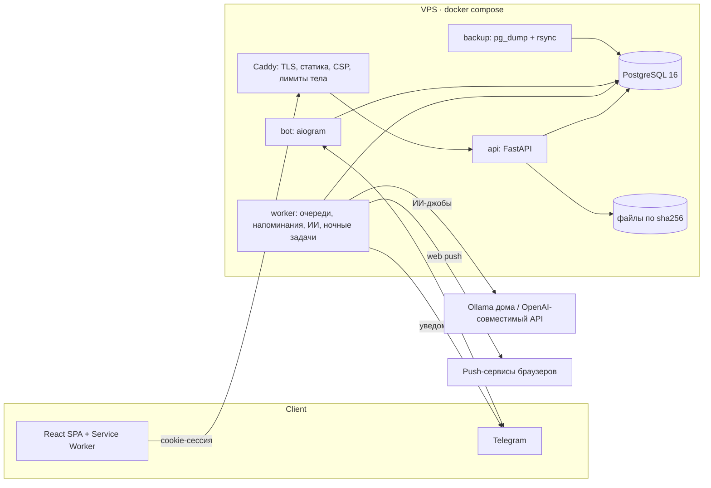

# Veillou

[](https://github.com/Noctau/Veillou/actions/workflows/ci.yml)


Личный планировщик учёбы и жизни: расписание пар, задания с шагами, проекты, конспекты,
экзамены — и автопланировщик, который раскладывает всё это по свободному времени.

## Проблема → решение

У студентки старших курсов одновременно пары по чётным/нечётным неделям, курсовая
с научруком, задания «с работы», чтение, экзамены и бытовые дела. Обычный календарь
показывает только жёсткие события; список задач не знает, когда их делать.

Veillou:

- **строит календарь из шаблонов**: сетка пар с числителем/знаменателем, звонки,
  праздники, сессия; личные повторы по RRULE;
- **разбивает задания на шаги** (вручную или с ИИ) с оценками и зависимостями;
- **сам планирует гибкие блоки** — CP-SAT на сетке 15 минут с учётом окон типа
  действия («деканат — в часы работы»), сна, обеда, лимита учёбы в день, минимума
  отдыха, недельной нормы проекта и дедлайнов; показывает **превью** изменений,
  применяется по кнопке и откатывается;
- **напоминает** в Web Push и Telegram с учётом тихих часов, склеивает совпавшее,
  кнопки «Сделано / +15 мин / На завтра» работают прямо из уведомления;
- **быстрый ввод** строкой («реферат по климатологии до 15 окт») и через бота,
  с ИИ-разбором длинного текста и фото доски;
- конспекты с Markdown и формулами, полнотекстовый поиск (Postgres FTS, русский),
  экзамены с планом подготовки по интервальным повторениям;
- PWA: офлайн-чтение, «Поделиться» в приложение на Android.

## Архитектура



**Слои бэкенда** (`backend/app/`):

| Слой | Что внутри |
|---|---|
| `api/` | тонкие роутеры FastAPI: зависимость `CurrentUser` + сервис |
| `services/` | бизнес-логика и работа с БД; `UserScopedRepository` ограничивает каждый запрос `user_id = :me AND deleted_at IS NULL` |
| `domain/` | чистые функции без БД: планировщик (CP-SAT + жадный fallback), разбор строки, RRULE, интервальные повторения |
| `models/`, `schemas/` | SQLAlchemy 2 (UUID, мягкое удаление, только aware-datetime) и Pydantic v2 (`extra="forbid"`) |
| `notify/` | когда и что напоминать, формат сообщений, отправители; `after_flush`-триггеры ставят джобы пересборки |
| `ai/` | провайдеры LLM, промпты, схемы ответов и eval-набор |
| `bot/`, `worker/`, `cli.py` | процессы и админ-команды |

**Очереди — в Postgres**: `jobs` и `reminders` забираются через `FOR UPDATE SKIP LOCKED`
с арендой; упавший воркер ничего не теряет. ИИ-запросы идут отдельной FIFO-очередью и
ждут, если модель недоступна.

## Стек и почему он

| Выбор | Почему |
|---|---|
| FastAPI + Pydantic v2 | типизированный API, OpenAPI → TS-типы фронта (`make gen-api`), валидация на входе |
| PostgreSQL (без Redis/брокера) | одна зависимость: и данные, и очереди (`SKIP LOCKED`), и полнотекстовый поиск |
| OR-Tools CP-SAT | планирование с ограничениями и целевой функцией за 2 с; жадный fallback, если решатель не успел |
| React 19 + TanStack Query + PWA | офлайн-кэш в IndexedDB, оптимистичные правки, установка на телефон |
| Caddy | HTTPS без настройки, статика и прокси в одном контейнере |
| uv / npm lock-файлы | воспроизводимые окружения, `uv sync --locked` в CI и Docker |

## Быстрый старт

Нужны Docker, [uv](https://docs.astral.sh/uv/) и Node 20+.

```bash
make install      # зависимости бэкенда и фронта, .env из .env.example
make dev          # Postgres (docker, :5433) + миграции + API :8000 + фронт :5173
make create-user email=me@example.com   # регистрации в приложении нет — пароль спросит
```

Открыть http://localhost:5173.

| Команда | Что делает |
|---|---|
| `make test` / `make test-cov` | pytest (БД `veillou_test` в том же контейнере) и vitest / с отчётом покрытия |
| `make lint` | ruff, `mypy --strict`, oxlint, tsc |
| `make audit` | pip-audit, npm audit, bandit, gitleaks |
| `make migrate` / `make migration m="..."` | применить / создать миграцию |
| `make gen-api` | OpenAPI бэкенда → `frontend/src/api/schema.d.ts` |
| `make worker` / `make bot` | фоновый процесс (напоминания, ИИ, ночные задачи) / Telegram-бот |
| `make vapid-keys` | ключи Web Push → вписать в `.env` |
| `make ai-evals` | эталонные задания для оценки промптов ИИ |

## Конфигурация

Все параметры — переменные окружения (`.env`, читает и бэкенд, и docker compose);
полный список с комментариями — [`.env.example`](.env.example) и
[`backend/app/core/config.py`](backend/app/core/config.py). Неверные значения
(часовой пояс, `APP_URL`, неполный запасной LLM, короткий `SECRET_KEY` в проде)
останавливают запуск с понятной ошибкой.

| Переменная | Зачем |
|---|---|
| `SECRET_KEY` | подпись ссылок на файлы; в проде обязателен, ≥ 32 символов (`openssl rand -hex 32`) |
| `POSTGRES_*` | подключение к БД |
| `TELEGRAM_BOT_TOKEN`, `TELEGRAM_BOT_USERNAME` | бот и привязка аккаунта |
| `VAPID_PUBLIC_KEY`, `VAPID_PRIVATE_KEY`, `VAPID_SUBJECT` | Web Push |
| `LLM_*`, `LLM_FALLBACK_*` | ИИ: Ollama или OpenAI-совместимый API, запасной провайдер |
| `AI_MAX_PENDING`, `AI_DAILY_LIMIT` | квота ИИ-запросов на пользователя |
| `LOGIN_*` | защита от перебора пароля |
| `MAX_UPLOAD_MB`, `MAX_REQUEST_BODY_KB` | лимиты тела запроса |

## Безопасность

- Сессии — случайный токен в HttpOnly/Secure/SameSite=Lax cookie, в БД — только sha256.
- Перебор пароля ограничен по адресу и аккаунту (429), argon2 — в потоке с лимитом
  параллельных проверок.
- Изоляция данных пользователей на уровне репозитория; проверено пробником IDOR по всем
  маршрутам ([AUDIT_REPORT.md](AUDIT_REPORT.md)).
- Файлы — по подписанным ссылкам; inline только безопасные типы, `nosniff` и
  `CSP: sandbox`; приложение — со строгим CSP и `frame-ancestors 'none'`.
- Тело запроса ограничено до аутентификации (ASGI-middleware и Caddy).
- Push — только на известные push-сервисы и без редиректов (без SSRF).
- В CI: gitleaks, pip-audit, npm audit, bandit, trivy (код и образы).

Аудит проекта и статус каждой находки — [AUDIT_REPORT.md](AUDIT_REPORT.md),
контекст и карта поверхности атаки — [AUDIT_CONTEXT.md](AUDIT_CONTEXT.md).

## Тестирование

```bash
make test        # backend: ~840 тестов на настоящем Postgres (миграции — те же, что в проде)
make test-cov    # покрытие ветвей, порог 88 % (сейчас ~92 %)
make test-web    # frontend: vitest
```

- Бэкенд: unit-тесты доменной логики, property-based тесты планировщика (hypothesis),
  API-тесты через ASGI, тесты гонок (двойные нажатия), бот — через подменённую сессию aiogram,
  ИИ — через `FakeProvider`.
- Фронтенд: чистая логика (время и DST, RRULE, черновик шагов, таймлайн), выход с отпиской
  от push, рендер Markdown/KaTeX.

## Структура

```
backend/
  app/            api · services · domain · models · schemas · notify · ai · bot · worker
  migrations/     Alembic (обратимые, CI сверяет с моделями)
  tests/
frontend/
  src/            features/* · pages · lib · sw (service worker)
infra/            Caddy, бэкапы, деплой, туннель к домашней Ollama
docker-compose.dev.yml   Postgres для разработки
docker-compose.prod.yml  прод: db, migrate, api, worker, bot, web, backup
```

## Деплой

VPS + Docker Compose + Caddy: `make deploy` с машины разработчика (rsync, сборка с
`--pull`, миграции отдельным сервисом до старта API), ежедневные бэкапы с ротацией
(`make prod-backup`, `make prod-restore b=latest`, `make backup-pull`). Базовые образы
зафиксированы по digest и обновляются Dependabot'ом.

## Дальнейшее развитие

- E2E-тесты основного сценария (Playwright) и визуальные проверки PWA.
- Шифрование бэкапов и вынос их за пределы сервера по расписанию.
- Ночные задачи по часовому поясу каждого пользователя (сейчас — один `DEFAULT_TIMEZONE`).
- Подтверждение изменений, которые ИИ вносит по фото задания.

## Лицензия

[MIT](LICENSE)
